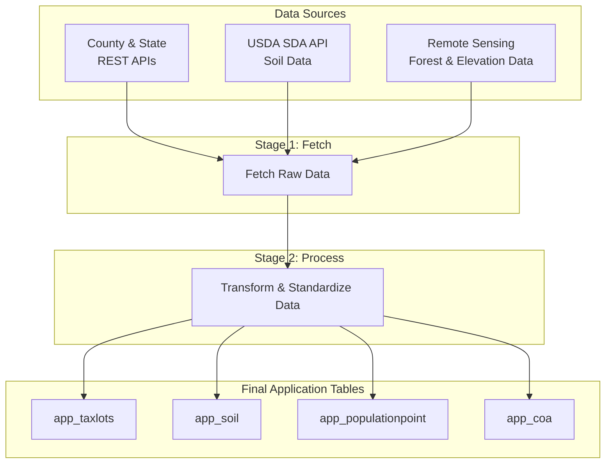

# Landmapper Data Pipeline Library (lm-dpl)

A Python library for procuring and processing Landmapper geospatial data layers.

## Project Structure

### Core Modules (/lm_dpl/)
- **cli.py**: Unified command-line interface for all pipeline operations
- **clients/**: Data source clients and API integrations
  - `restclient.py`: REST API client for parcel data sources
  - `sdaclient.py`: Soil Data Access (SDA) API client
  - `db_manager.py`: Database connection and session management
  - `endpoints.yaml`: Configuration for data endpoints and field mappings
- **parcels/**: Parcel data processing and transformation
  - `processor.py`: Main parcel data processor with state-specific logic
  - Oregon and Washington SQL scripts for schema creation and data processing
- **soil/**: Soil data processing and analysis
  - `processor.py`: Soil data processor with USDA SDA integration
  - Database schemas for soil data storage
- **forest/**: Forest and elevation data processing
  - `parcel_elevation.py`: Elevation data extraction and processing
  - `datasets.py`: Forest dataset utilities and management
  - SQL schemas for forest data classification
- **utils/**: Shared utilities and configuration
  - `config.py`: Configuration management and environment variables
  - `db_utils.py`: Database utilities and operations
  - `emailu.py`: Automated email notifications for pipeline status
  - `logging_utils.py`: Logging configuration and utilities


### Pipeline Workflow

The lm-dpl data pipeline follows a two-stage process: **Fetch** and **Process**. Data flows from multiple sources through staging tables to final application tables:



#### Workflow Stages:

**1. Data Sources** - The pipeline integrates data from three primary sources. See [Data Sources](docs/data_sources.md) for more details.
- **Parcel Data**: County and state REST APIs to fetch data such as taxlots, PLSS, and FPD data. 
- **Soil Data**: USDA Soil Data Access (SDA) API for soil characteristics and classifications
- **Remote Sensing Data**: Remote sensing sources for elevation data and forest cover data.

**2. Fetch Stage** - Raw data is fetched from external sources and loaded into staging tables:
- **API Integration**: Handles connection, rate limiting, and query construction.
- **Staging Tables**: Temporary storage for raw data before processing.
- **Post-processing**: For data validation, cleaning, normalization, and deduplication. The path of the post-processing script can be defined in the endpoints configuration.

**3. Process Final Application Tables** - Data is exported to final application tables matching Landmapper's data model:
- **`app_taxlots`**: Parcel boundaries and tax assessment data
- **`app_soil`**: Soil characteristics and classifications
- **`app_populationpoint`**: Population distribution and demographic data
- **`app_coa`**: Conservation opportunity areas and planning data

The pipeline supports both Oregon and Washington states with state-specific processing logic while maintaining consistent output schemas. 

See [Pipeline Execution](docs/pipeline_execution.md) for detailed instructions on running the pipeline for each state.

## Installation

### Prerequisites

- Python 3.11 or higher
- GDAL 3.4.3 or higher
- PostgreSQL with PostGIS extension (for database operations)
- Git (for cloning the repository)

### Quick Installation

```bash
pip install git+https://github.com/Ecotrust/lm-dpl.git
```

### Development Installation

1. Clone the repository:
```bash
git clone https://github.com/Ecotrust/lm-dpl.git
cd lm-dpl
```

2. (Optional) Create and activate a virtual environment:
```bash
python -m venv venv
source venv/bin/activate  
```

3. Install in editable mode with development dependencies:
```bash
pip install -e ".[dev]"
```

### Database Setup

The lm-dpl library requires access to a PostgreSQL database with PostGIS extension.

1. Setup your .env file with environment variables:
```
# LandMapper Data Pipeline Environment Configuration

# For reporting errors via email (optional). Currently only Gmail is supported.
SENDER_EMAIL=<email>
GMAIL_APP_PASSWORD=<password>
RECIPIENT_EMAIL=<email>

# Logging configuration (optional - auto-generated if not set)
LOG_PATH=./logs/lm-dpl.log

# PostGIS service configuration
POSTGRES_DB=gis
POSTGRES_USER=gis
POSTGRES_PASSWORD=password
POSTGRES_HOST=localhost
POSTGRES_PORT=5432
```

2. Run Docker container for PostGIS database:
```bash
cd docker && docker compose up -d
```

### Verifying Installation

After installation, you can verify that the CLI is working correctly:

```bash
lm-dpl --help
```

This should display the help information for the lm-dpl command-line interface.


## Command-Line Interface

The CLI has three main subcommands: `fetch`, `process`, and `import-file`.

### Fetch Command

Fetch data from remote sources for the specified state.

```bash
# Fetch all layers for a state (Oregon or Washington)
lm-dpl fetch <state>

# Fetch specific layers 
lm-dpl fetch --layer <layer_name> <state>

# Fetch multiple layers for a state
lm-dpl fetch --layer <layer_name1> --layer <layer_name2> <state>

# Fetch with overwrite flag (WARNING: Deletes existing data)
# NOTE: soil and elevation layers do not have overwrite option.
lm-dpl fetch --overwrite --layer <layer_name> <state>
```

Available layers for fetching:
  - **taxlots**: Tax lot parcels boundaries.
  - **zoning**: Zoning designations and land use regulations
  - **plss**: Public Land Survey System (PLSS) township and range data
  - **fpd**: Fire Protection Districts and service boundaries
  - **sfd**: Structural Fire Districts (only available in Oregon)
  - **ppa**: USA Census Populated Place Areas
  - **coa**: Conservation Opportunity Areas and planning designations (Only available in Oregon)
  - **cty**: County boundaries and administrative divisions.
  - **huc**: 12-digit Hydrologic Unit (HU12) polygon boundaries
  - **soil**: USDA soil characteristics and classifications
  - **elevation**: Digital elevation model and terrain data, forest cover.

Fetch with custom configuration file.

You can provide a custom configuration file to override default endpoint settings:

```bash
lm-dpl fetch --config custom_endpoints.yml <state>
```

The configuration file should look like this:

```yaml
# Example custom endpoints configuration
state:
  - layer_name:
      description: "Layer description" # Optional
      epsg: 4326  # Optional
      outfields: field1,field2,field3   # Source column names
      dtypes: varchar,varchar,integer   # Target column data types 
      where: "field1 = 'value1'"  # Optional. Filter query results
      url: "https://api.example.com/arcgis/rest/services/..."
      fetch: true # Fetch data from this endpoint, if false, endoint will be skipped
      max_records: 1000  # rate limit for the endpoint
      geom: true # to fetch as a spatial layer
      post_script: "path/to/script.sql"  # Optional script to run after fetching
```

Fetch data from a shapefile.

```bash
# Import data from a shapefile into a staging table
lm-dpl import-file <shapefile> <target table name> --srid <epsg code> --t-srid <epsg code>
```

### Process Command

Process fetched data to generate application tables.

```bash
# Process taxlots table for a state
lm-dpl process --table <table> --state <state>
```

